# CorvusSKK ver. 2.8.0

Windowsで動作するSKK風のIMEです。

## インストール

### 対応OS

* Windows Vista (32-bit / 64-bit)

    * Service Pack 2
    * プラットフォーム更新プログラム ( [KB971644](https://support.microsoft.com/en-us/kb/971644) または [KB971512](https://support.microsoft.com/en-us/kb/971512) )

* Windows 7     (32-bit / 64-bit)

    * Service Pack 1

* Windows 8     (32-bit / 64-bit)

* Windows 8.1   (32-bit / 64-bit)

    * S14 Update ( [KB2919355](https://support.microsoft.com/en-us/kb/2919355) )

* Windows 10    (32-bit / 64-bit / ARM)

### インストール

corvusskk-X.Y.Z.exe を実行してください。 (X, Y, Z はバージョン番号)

Windows 10 on ARM では corvusskk-X.Y.Z-arm.exe を実行してください。

アップデートの後はOSを再起動しておくと安全です。

インストール先

* 32bit 版 Windows

    * %SystemRoot%\System32\IME\IMCRVSKK

* 64bit 版 Windows

    * %SystemRoot%\System32\IME\IMCRVSKK
    * %SystemRoot%\SysWOW64\IME\IMCRVSKK

* ARM 版 Windows

    * %SystemRoot%\System32\IME\IMCRVSKK
    * %SystemRoot%\SysArm32\IME\IMCRVSKK
    * %SystemRoot%\SysWOW64\IME\IMCRVSKK

* 共通

    * %SystemRoot%\IME\IMCRVSKK

### アンインストール

コントロールパネルの「プログラムと機能」からアンインストールしてください。

または、インストールに使用した exe ファイルを再度実行し「Uninstall」を選択してください。

アンインストールの後はOSを再起動しておくと安全です。

### Windows ストアアプリ、Microsoft Edge

Windows ストアアプリ、Microsoft Edge 等で使用するには、設定ファイル (config.xml) にアクセス許可を付加させる必要があります。

Windows 8 以降で動作する設定ダイアログでOKボタンを押して保存をおこなうとアクセス許可の付加が自動的におこなわれます。

また、Windows 8 以前から Windows 8 以降へ Windows をアップグレードしたときは、CorvusSKK を一旦アンインストールした上でインストールし直してください。

インストール時に、Windows ストアアプリ、Microsoft Edge 等で使用可能となるようにIMEの登録がおこなわれます。

### Adobe Reader X, XI, Acrobat Reader DC

Adobe Reader X 以降で使用するには、設定ファイル (config.xml) にアクセス許可を付加させる必要があります。

設定ダイアログでOKボタンを押して保存をおこなうとアクセス許可の付加が自動的におこなわれます。

## 設定

### 設定ダイアログ

設定ダイアログは、以下のいずれかの操作で開くことができます。

* 言語バーを右クリックし、メニューから「設定」を選択する。「テキストサービスと入力言語」ダイアログの「インストールされているサービス」からCorvusSKKを選択し、プロパティボタンを押す。
* 言語バーの入力モードアイコンを左クリックし、メニューから「設定」を選択する。
* 言語バーのヘルプボタンを左クリックし、メニューから「CorvusSKK」を選択する。
* Windows 8 以降の通知領域の入力モードアイコンを右クリックし、メニューから「設定」を選択する。
* スタートメニューから CorvusSKK\CONFIG を実行する。
* %SystemRoot%\System32\IME\IMCRVSKK\imcrvcnf.exe または %SystemRoot%\SysWOW64\IME\IMCRVSKK\imcrvcnf.exe を直接実行する
  * コマンドライン引数、または実行ファイルやショートカットへのドラッグアンドドロップで、後述の設定ファイルを渡すことが可能です。

設定ダイアログで保存した後は、IME OFF → ON で新しい設定が反映されます。

IME ON/OFF のキーのみ、IME ON → OFF のときにも反映されます。

### 設定ファイル、SKK辞書

各種設定及び取込済SKK辞書は、ディレクトリ %AppData%\CorvusSKK の各ファイルに保存されます。

| ファイル名 | 説明 |
|---|---|
| config.xml  | 各種設定 |
| skkdict.txt | 取込済SKK辞書 |

* 設定サンプル https://github.com/nathancorvussolis/corvusskk/blob/master/installer/config-sample
* デフォルト https://github.com/nathancorvussolis/corvusskk/tree/master/installer/config-share

各種設定の config.xml ファイルは、UTF-8 の XML フォーマットのテキストファイルとなっています。

設定ダイアログで OK ボタンまたは適用ボタンを押すと config.xml ファイルが保存されます。テキストエディタなどでも編集可能です。変更した後は、IME OFF → ON で新しい設定が反映されます。

取込済SKK辞書の skkdict.txt ファイルは、UTF-16 (LE, BOMあり) のSKK辞書フォーマットとなっています。

設定ダイアログのリストにSKK辞書を追加して取込ボタンを押すと取込済SKK辞書に変換されます。後述の[SKK辞書](#skk辞書)の項を参照してください。

ディレクトリ %SystemRoot%\IME\IMCRVSKK に NAIST-jdic をベースとした簡易的なSKK辞書が標準でインストール済みとなっています。取込済SKK辞書が存在しないときはこのSKK辞書が使用されます。

SKK辞書サーバーを使用するなどでローカルのSKK辞書を使用したくないときは、設定ダイアログのSKK辞書のリストが空またはチェック無しの状態で取込処理をおこなってください。空の取込済SKK辞書が生成されます。

下記のディレクトリの優先順位で各ファイルが読み込まれます。

1. %AppData%\CorvusSKK
2. %SystemRoot%\IME\IMCRVSKK (インストーラーによりインストール済み)

> **開発者向け**
>
> デバッグビルドでは、ディレクトリ %AppData%\CorvusSKK_DEBUG の各ファイルに保存されます。
>
> デバッグビルドでは、下記のディレクトリの優先順位で各ファイルが読み込まれます。
>
> 1. %AppData%\CorvusSKK_DEBUG
> 2. 実行ファイルと同じディレクトリ (ビルドするとディレクトリ installer\config-share から上書きコピーされます)

### ユーザー辞書

ユーザー辞書は、ディレクトリ %AppData%\CorvusSKK の各ファイルに保存されます。

| ファイル名 | 説明 |
|---|---|
| userdict.txt | ユーザー辞書 |
| userdict.bk1 userdict.bk2 userdict.bk3 | ユーザー辞書バックアップ (3世代まで) |

UTF-16 (LE, BOMあり) のSKKユーザー辞書フォーマットで書き込まれます。

ユーザー辞書を直接編集する際は、ログオンユーザー権限で動作している辞書管理プロセス (imcrvmgr.exe) をタスクマネージャなどで終了させた状態でおこなってください。

編集後、以下のいずれかの操作をおこなうと辞書管理プロセスが自動的に起動します。

* IME OFF → ON
* 仮名漢字変換開始
* 補完開始

辞書管理プロセスを直接実行することも可能です。

ユーザー辞書は、辞書管理プロセスの起動時にメモリ上に読み込まれ、候補の確定、登録、削除があったとき、かつ、以下のいずれかのときに上書きされます。

* IME ON → OFF のとき
* IME ON 状態のアプリケーションが終了するとき
* IME ON 状態で別の IME に切り替えるとき
* アプリケーションがフォーカスを失うとき
* 辞書管理プロセスが終了するとき
* スリープ、休止状態から復帰するとき

ユーザー辞書バックアップは辞書管理プロセスによって以下のいずれかのときに作成されます。

* シャットダウン、再起動するとき
* ログオフ、スリープ、休止状態から復帰するとき

### SKK辞書

SKK辞書の詳細はこちらを参照ください。

* https://skk-dev.github.io/dict/

* http://openlab.ring.gr.jp/skk/wiki/wiki.cgi

こちらから辞書をダウンロード出来ます。

* https://github.com/skk-dev/dict

* http://openlab.ring.gr.jp/skk/skk/dic/

SKK辞書ファイルの文字コードは、EUC-JIS-2004、UTF-8 (BOMなし/あり)、UTF-16 (LE, BOMあり) に対応しています。

アーカイブファイルフォーマットは tar、gzip に対応しています。

* 対応する拡張子は、 .gz、.tar、.tar.gz、.tgz です。

* 拡張子が .tar、.tar.gz、.tgz の場合、拡張子を除いたアーカイブファイル名をファイル名の末尾に含むファイルが対象となります。(ただしドットファイルは対象外)

    * zipcode.tar.gz の場合、SKK-JISYO.zipcode や SKK-JISYO.office.zipcode などが対象となり、SKK-JISYO.zipcode.orig や SKK-JISYO.office.zipcode.orig、.zipcode などは対象外となります。

    * SKK-JISYO.edict.tar.gz の場合、SKK-JISYO.edict などが対象となります。

設定ダイアログのリストにSKK辞書を追加し、取込ボタンを押してください。取込済SKK辞書に変換されて使用可能となります。

チェックボックスを外すと取込の対象外となります。

リストの選択されている行をクリックするとインライン編集することができます。

SKK辞書のURLを追加した場合は、取込処理のときにディレクトリ %TMP%\CorvusSKK または %TEMP%\CorvusSKK にダウンロードされてから取り込まれます。

SKK辞書のダウンロード機能では HTTP, HTTPS が使用可能です。プロキシはOSに設定されたものが使用されます。

### SKK辞書サーバー

別途用意されたSKK辞書サーバーと通信して、skkservプロトコルのクライアントとして辞書検索をおこないます。

同時に１つのみ使用可能です。IPv4、IPv6 に対応しています。

通信に使用する文字コードは、EUC-JIS-2004、UTF-8 に対応していますが、通常のSKK辞書サーバーではデフォルトの EUC-JIS-2004 を使用してください。

サーバーコンプリーション機能は未実装です。

### 動作

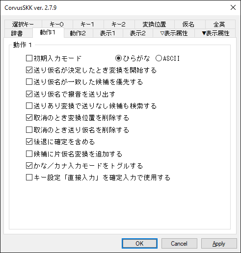

| 機能 | 説明 |
|---|---|
| 初期入力モード                       | プログラム起動時の入力モードを指定します。 |
| 送り仮名が決定したとき変換を開始する | 送り仮名を入力したとき自動的に変換を開始します。接頭辞も同様です。 |
| 送り仮名が一致した候補を優先する     | 送り仮名ブロックの送り仮名が一致する候補を優先して出力します。 |
| 送り仮名で撥音を送り出す             | 送り仮名入力開始後の変換位置指定を含む「な/にゃ」行の入力で「ん」を送り出します。 例) ON:「NoNO」→「▽の\*んお」/ OFF:「NoNO」→「▽の\*の」 |
| 送りあり変換で送りなし候補も検索する | 送りあり変換のとき送りありの候補に加え送りなしの候補も検索します。 デフォルトでサ行の活用のみ init.luaのenable_skk_search_sagyo_onlyがfalseのとき全ての活用 |
| 取消のとき変換位置を削除する         | ▼モードから▽モードに遷移する際、送り仮名の位置情報を削除します。 |
| 取消のとき送り仮名を削除する         | ▼モードから▽モードに遷移する際、送り仮名の部分を削除します。 |
| 後退に確定を含める                   | ▼モードのとき後退すると一文字削除した上で確定します。 OFFでは▼モードのとき後退は前候補と同じ機能を有します。 |
| 候補に片仮名変換を追加する           | 見出し語を片仮名に変換した候補を追加します。 |
| かな／カナ入力モードをトグルする | キー設定「かな／カナ」「ｶﾅ全英変換」のキーでひらがなモードに遷移します。 無効のときは、キー設定「ひらがな」のキーでひらがなモードに遷移してください。 |
| キー設定「直接入力」を確定入力で使用する | 確定入力のとき、キー設定の「直接入力」で設定された文字で始まるローマ字を仮名変換しません。 (ひらがな/カタカナ/半角カタカナモードのとき) |

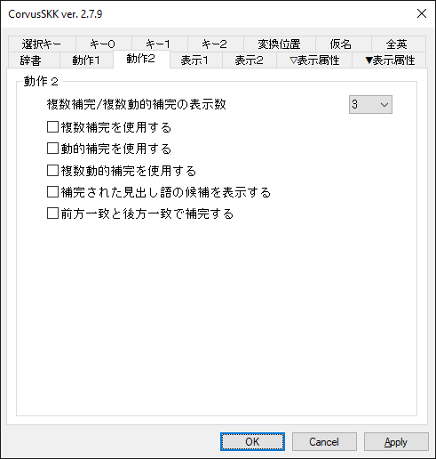

| 機能 | 説明 |
|---|---|
| 複数補完/複数動的補完の表示数        | 複数補完、複数動的補完での1ページあたりの候補数を指定します。 |
| 複数補完を使用する                   | 通常の補完のとき、ユーザー辞書から補完された見出し語を一覧で表示します。 補完対象は「候補一覧の色」の「選択」、補完部分は「候補」の色が使用されます。 |
| 動的補完を使用する                   | 見出し語が入力されたとき、ユーザー辞書から補完された見出し語を表示します。 |
| 複数動的補完を使用する               | 見出し語が入力されたとき、ユーザー辞書から補完された見出し語を一覧で表示します。 補完対象は「候補一覧の色」の「選択」、補完部分は「候補」の色が使用されます。 |
| 補完された見出し語の候補を表示する   | 補完/複数補完/動的補完/複数動的補完のとき、ユーザー辞書の検索結果を追加して表示します。 表示する候補の数は最大で「候補一覧表示に要する変換回数」-1 です。 補完/動的補完では「▽表示属性」の「\*送り」の色が使用されます。 複数補完/複数動的補完では「候補一覧の色」の「注釈」の色が使用されます。 |
| 前方一致と後方一致で補完する         | 通常の前方一致での補完に加えて後方一致でも補完します。 |

### 表示

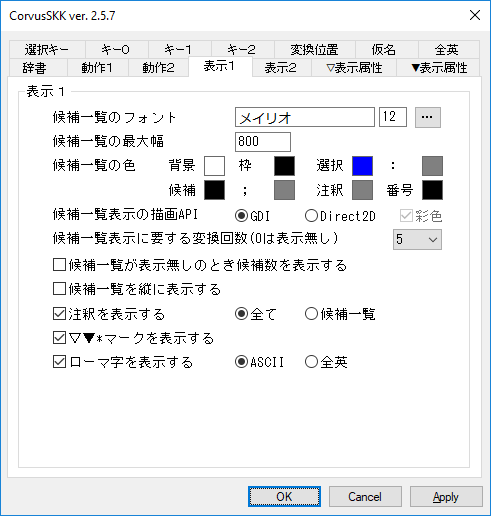

| 機能 | 説明 |
|---|---|
| 候補一覧のフォント                        | 候補一覧に表示するフォントの種類、スタイル、サイズを指定します。 |
| 候補一覧の最大幅                          | 候補一覧の最大幅のサイズを指定します。 |
| 候補一覧の色                              | 候補一覧の色を指定します。 |
| 候補一覧の描画API                         | 候補一覧の描画をおこなうAPIを指定します。 Direct2Dと彩色の指定でカラーフォントを表示します。(Windows8.1以降) |
| 候補一覧表示に要する変換回数(0は表示無し) | 指定した回数変換すると候補一覧が表示されます。 |
| 候補一覧が表示無しのとき候補数を表示する  | (<現在の候補の番号>/<候補数>) の形式を追加して表示します。 |
| 候補一覧を縦に表示する                    | 候補一覧で候補を縦に並べて表示します。 |
| 注釈を表示する                            | <候補><セミコロン><注釈> の形式で注釈を表示します。 「候補一覧」の指定で候補一覧に限定されます。 |
| ▽▼\*マークを表示する                    | 大切なものは目に見えないようです。 |
| ローマ字を表示する                        | 仮名文字のローマ字プレフィックスを表示します。 「全英」の指定でいわゆる全角文字で表示されます。 |

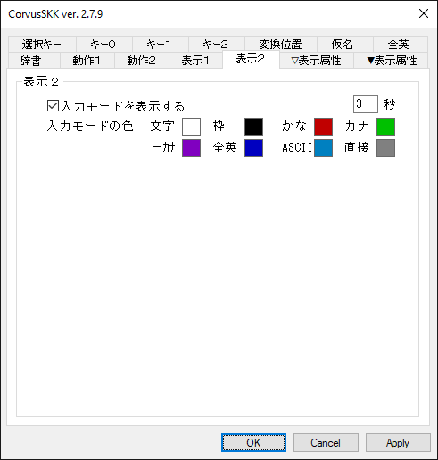

| 機能 | 説明 |
|---|---|
| 入力モードを表示する                      | キャレットまたは辞書登録ウィンドウ付近に入力モードを表示します。 タイミングは、IME ON/OFF 変更、入力モード変更、IME ON/OFF キー押下、「\*無効\*」キー押下のときです。 表示する秒数として1〜60000ミリ秒を設定してください。デフォルト値は3000ミリ秒です。 |
| 入力モードの色                            | 入力モード表示の色を指定します。 |

### 表示属性

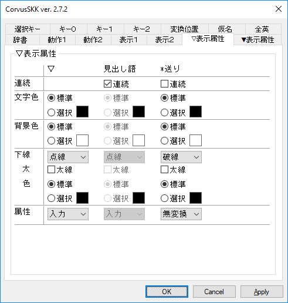

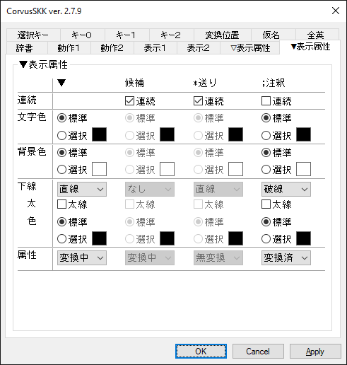

入力中文字列の表示属性を設定します。

「連続」のチェックボックスをチェックすると、表の左側の表示属性を継承し、下線は繋って表示されます。

確定入力モードでのローマ字は連続のチェックの有無に関わらず見出し語と同じ表示属性となります。

### 候補一覧選択キー

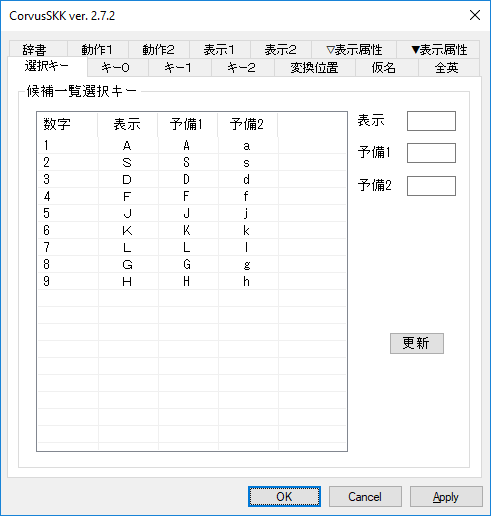

候補一覧での確定は、デフォルトで 1〜7 と ASDFJKL と asdfjkl を使用します。

コマンドプロンプト等では、デフォルトで 1〜9 と ASDFJKLGH と asdfjklgh を使用します。

候補一覧が表示されているとき、KANAキーロックは無視されます。

| 機能 | 説明 |
|---|---|
| 数字 | 選択キー (1〜9で固定) |
| 表示 | 選択キー (必須、候補一覧の表示にも使用) |
| 予備1,2 | 選択キー (空でもOK) |

### キー設定（ON/OFF）

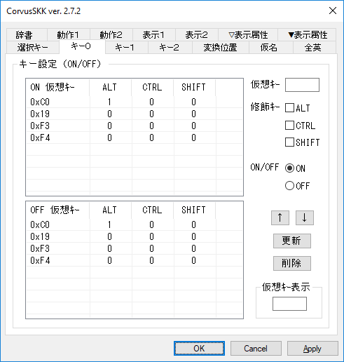

IME ON/OFF のキーをそれぞれ指定します。

仮想キーコード、Alt、Control、Shift の組合せを設定してください。

「仮想ｷｰ表示」エディットボックスにフォーカスがある状態でキー入力すると仮想キーコードを表示します。

仮想キーコードの詳細はこちらを参照ください。 https://docs.microsoft.com/en-us/windows/win32/inputdev/virtual-key-codes

最大で ON/OFF それぞれ8行ずつです。

### キー設定（文字）、キー設定（仮想キー）

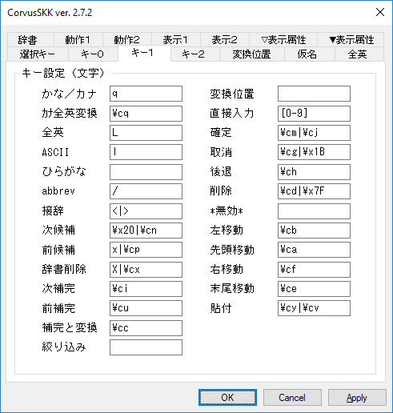

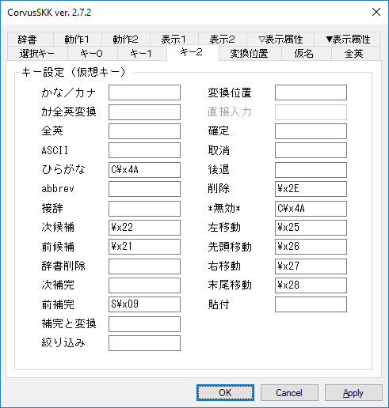

各機能に対してキーを正規表現で設定してください。

Visual C++ 2019 の 正規表現で、文法は ECMAScript を使用しています。

正規表現の詳細はこちらを参照ください。 https://docs.microsoft.com/en-us/cpp/standard-library/regular-expressions-cpp?view=vs-2019

無効な正規表現で設定するとその機能は無効となります。警告等は表示されません。

キー設定（文字）とキー設定（仮想キー）とで重複する場合は、キー設定（仮想キー）のほうが優先されます。

キー設定（文字）には ASCII の範囲内の文字を設定出来ます。

キー設定（仮想キー）にはShiftキー(S)またはCtrlキー(C)をキーコードに前置することで、修飾キーを設定出来ます。

例えば、Shift+Tabであれば「S\x09」、Ctrl+Returnであれば「C\x0D」と記述します。

### キー設定デフォルト

キー設定 ON/OFF

| 機能 | キー | 説明 |
|---|---|---|
| ON / OFF  | Alt+\`                  | 0xC0 + Alt |
| 〃        | 漢字                    | 0x19 |
| 〃        | (Alt+半角/全角  Alt+\`) | 0x19 |
| 〃        | 半角/全角(Ctrl+\`)      | 0xF3, 0xF4 |

キー設定（文字）

| 機能 | キー | 説明 |
|---|---|---|
| かな／カナ | q                      | ひらがな／カタカナモード、かなカナ変換 |
| ｶﾅ全英変換 | Ctrl+q                 | ひらがな／半角カタカナモード ひらがなカタカナ→半角カタカナ変換 abbrev→全角英数字変換 |
| 全英       | L                      | 全英モード |
| ASCII      | l                      | アスキーモード |
| ひらがな   |                        | ひらがなモード |
| abbrev     | /                      | abbrevモード |
| 接辞       | <  >                   | 接頭辞・接尾辞 |
| 次候補     | Space  Ctrl+n          | 辞書検索開始、次候補 |
| 前候補     | x  Ctrl+p              | 「後退」のキーも使用可 |
| 辞書削除   | X  Ctrl+x              | ユーザー辞書から候補を削除 |
| 次補完     | Ctrl+i(Tab)            | 補完開始、次見出し語候補 |
| 前補完     | Ctrl+u                 | 前見出し語候補 |
| 補完と変換 | Ctrl+c                 | 最初の見出し語候補で辞書検索開始 skk-start-henkan-with-completion-char |
| 絞り込み   |                        | 候補を絞り込む見出し語の入力開始 skk-hint-start-char |
| 変換位置   |                        | 変換位置指定 2回連続入力で文字自体が確定する skk-sticky-key |
| 直接入力   | 0〜9                   | 見出し語入力でローマ字仮名変換しない |
| 確定       | Ctrl+m(Return)  Ctrl+j |  |
| 取消       | Ctrl+g  Ctrl+[(Escape) |  |
| 後退       | Ctrl+h(BS)             |  |
| 削除       | Ctrl+d  DEL(Ctrl+BS)   |  |
| \*無効\*   |                        | アプリケーション側に非通知 辞書登録/削除の確定無効 |
| 左移動     | Ctrl+b                 |  |
| 先頭移動   | Ctrl+a                 |  |
| 右移動     | Ctrl+f                 |  |
| 末尾移動   | Ctrl+e                 |  |
| 貼付       | Ctrl+y  Ctrl+v         | クリップボードの文字列を貼り付け |

  キー設定（仮想キー）

| 機能 | キー | 説明 |
|---|---|---|
| かな／カナ |                        | ひらがな／カタカナモード、かなカナ変換 |
| ｶﾅ全英変換 |                        | ひらがな／半角カタカナモード ひらがなカタカナ→半角カタカナ変換 abbrev→全角英数字変換 |
| 全英       |                        | 全英モード |
| ASCII      |                        | アスキーモード |
| ひらがな   | Ctrl+0x4A (Ctrl+j)     | ひらがなモード |
| abbrev     |                        | abbrevモード |
| 接辞       |                        | 接頭辞・接尾辞 |
| 次候補     | 0x22 (PgDn)            | 辞書検索開始、次候補 |
| 前候補     | 0x21 (PgUp)            | 「後退」のキーも使用可 |
| 辞書削除   |                        | ユーザー辞書から候補を削除 |
| 次補完     |                        | 補完開始、次見出し語候補 |
| 前補完     | Shift+0x09(Shift+Tab)  | 前見出し語候補 |
| 補完と変換 |                        | 先頭の見出し語候補で辞書検索開始 skk-start-henkan-with-completion-char |
| 絞り込み   |                        | 候補を絞り込む見出し語の入力開始 skk-hint-start-char |
| 変換位置   |                        | 変換位置指定 skk-sticky-key |
| 直接入力   |                        | 見出し語入力でローマ字仮名変換しない（不使用） |
| 確定       |                        |  |
| 取消       |                        |  |
| 後退       |                        |  |
| 削除       | 0x2E (Delete)          |  |
| \*無効\*   | Ctrl+0x4A (Ctrl+j)     | アプリケーション側に非通知 辞書登録/削除の確定無効 |
| 左移動     | 0x25 (カーソル左)      |  |
| 先頭移動   | 0x26 (カーソル上)      |  |
| 右移動     | 0x27 (カーソル右)      |  |
| 末尾移動   | 0x28 (カーソル下)      |  |
| 貼付       |                        | クリップボードの文字列を貼り付け |

### キー設定と入力モード遷移図

### 半角カタカナモード

半角カタカナモードでは、ローマ字仮名変換のみ可能です。

ひらがな/カタカナへの変換、仮名漢字変換は出来ません。

### 変換位置指定

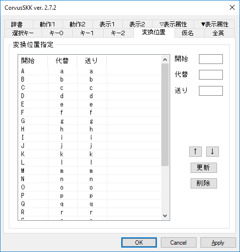

変換位置での挙動を指定します。最大で256行です。

| 機能 | 説明 |
|---|---|
| 開始 | 変換位置開始キー |
| 代替 | 変換位置開始キーに代わってローマ字仮名変換に使用する |
| 送り | 辞書検索に使用する送りローマ字 |

* 例１）AZIK風に以下のように設定したとき「KaQ」と入力すると、表示「▽か\*ん」、辞書検索キー「かn」と入力できます。

    | 開始 | 代替 | 送り |
    |---|---|---|
    | Q | q | n |

    | ローマ字 | かな | カナ | ｶﾅ | 促／ん | 待機 |
    |---|---|---|---|---|---|
    | q | ん | ン | ﾝ | OFF | OFF |

* 例２）以下のように設定したとき、かな入力で送り仮名の最初を「あ」の状態で辞書検索を開始すると、送りローマ字が「a」となります。

    | 開始 | 代替 | 送り |
    |---|---|---|
    |  | あ | a |

### ローマ字・仮名変換表

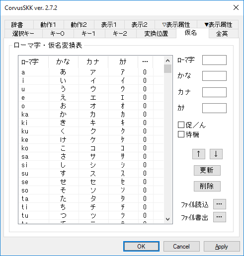

ローマ字、平仮名、片仮名、所謂半角片仮名、促音/撥音(ん)、待機の組み合せを指定します。

* 「促／ん」
    * 「促／ん」がONのとき、仮名が決定したあとに最後の入力文字が入力状態となります。
    * 例１） 以下のように設定したとき「motto」と入力することで「もっと」と入力することができます。

        | ローマ字 | かな | カナ | ｶﾅ | 促／ん | 待機 |
        |---|---|---|---|---|---|
        | mo | も | モ | ﾓ | OFF | OFF |
        | tt | っ | ッ | ｯ | **ON** | OFF |
        | to | と | ト | ﾄ | OFF | OFF |

    * 例２） 以下のように設定したとき「dango」と入力することで「だんご」と入力することができます。

        | ローマ字 | かな | カナ | ｶﾅ | 促／ん | 待機 |
        |---|---|---|---|---|---|
        | da | だ | ダ | ﾀﾞ | OFF | OFF |
        | ng | ん | ン | ﾝ | **ON** | OFF |
        | go | ご | ゴ | ｺﾞ | OFF | OFF |

    * 例３） 以下のように設定したとき「w」の連続入力により草を生やすことができます。

        | ローマ字 | かな | カナ | ｶﾅ | 促／ん | 待機 | 説明 |
        |---|---|---|---|---|---|---|
        | ww | ｗ | ｗ | ｗ | **ON** | OFF | Latin Small Letter W → Fullwidth Latin Small Letter W |
        | w | ｗ | ｗ | ｗ | OFF | OFF | Latin Small Letter W → Fullwidth Latin Small Letter W |

* 「待機」
    * 「待機」がONのとき、入力した文字をローマ字仮名変換した結果 (変換出来ないときは入力した文字そのまま) がローマ字として扱われ、辞書検索開始、確定、補完開始、ローマ字に設定されていない組み合わせ、のいずれかになるまで仮名の最終的な決定が遅延されます。
    * 「待機」機能サンプルを参照してください。[https\://github.com/nathancorvussolis/corvusskk/blob/master/installer/config-sample/config - wait-sample.xml](https://github.com/nathancorvussolis/corvusskk/blob/master/installer/config-sample/config%20-%20wait-sample.xml)
    * 例１） カナキーロックした状態で「か」と濁点を入力することで「が」と入力することができます。濁点、半濁点のローマ字部分は、現状1文字のみ対応しています。

        | ローマ字 | かな | カナ | ｶﾅ | 促／ん | 待機 | 説明 |
        |---|---|---|---|---|---|---|
        | ｶ | か | カ | ｶ | OFF | **ON** | JIS X 0201 仮名 → JIS X 0208 仮名 |
        | ﾞ | ゛ | ゛ | ﾞ | OFF | **ON** | JIS X 0201 濁点 → JIS X 0208 濁点 |
        | か゛ | が | ガ | ｶﾞ | OFF | ON または OFF | 仮名と濁点の合成 待機OFFのとき直ちに確定または辞書検索開始します |

    * 例２） 以下のように設定したとき「zsssss …」と入力することで「☆」と「★」が繰り返され任意のタイミングで確定することができます。

        | ローマ字 | かな | カナ | ｶﾅ | 促／ん | 待機 | 説明 |
        |---|---|---|---|---|---|---|
        | zs | ☆ | ☆ | ☆ | OFF | **ON** |  |
        | ☆s | ★ | ★ | ★ | OFF | **ON** |  |
        | ★s | ☆ | ☆ | ☆ | OFF | **ON** |  |

    * 例３） 以下のように設定したとき「w」の連続入力により草を生やすことができます。

        | ローマ字 | かな | カナ | ｶﾅ | 促／ん | 待機 | 説明 |
        |---|---|---|---|---|---|---|
        | w | ｗ | ｗ | ｗ | OFF | **ON** | Latin Small Letter W → Fullwidth Latin Small Letter W |

平仮名／片仮名変換では基本的に１文字ずつ変換されます。
* 例） 平仮名「きょう」を片仮名「キョウ」に変換する場合、「きょ」→「キョ」、「う」→「ウ」ではなく、「き」→「キ」、「ょ」→「ョ」、「う」→「ウ」と変換されます。
* 例外として、「う゛」(う＋濁点)は「ウ゛」(ウ＋濁点)ではなく「ヴ」と変換されます。

最大で32768行です。

「…」ボタンから、KanaTableファイルの読み込みと書き出しをおこなうことができます。

### KanaTableファイル

* 文字コード：UTF-16(LE,BOMあり) または UTF-8
* 改行：CR+LF または LF
* フォーマット：<ローマ字><\t><ひらがな><\t><カタカナ><\t><カタカナ(半角)><\t><[促/ん]/[待機]><\r><\n>
    * <ローマ字>、<ひらがな>、<カタカナ>、<カタカナ(半角)>は、それぞれUTF-16換算で最大14バイトです。
    * [促/ん]は、ONのとき1、OFFのとき0です。
    * [待機]は、ONのとき2、OFFのとき0です。
    * <[促/ん]|[待機]>は、[促/ん]と[待機]の両方がONのとき3となりますが、[待機]のほうが優先されます。 (0のときは無しでも可)
    * 空行やタブのみの行は読み飛ばされます。
    * <\t>、<\r>、<\n>は、それぞれタブ、改行コードに読み替えてください。
* サンプルを参照してください。 https://github.com/nathancorvussolis/corvusskk/blob/master/installer/config-sample/kanatable.txt

### ASCII・全英変換表

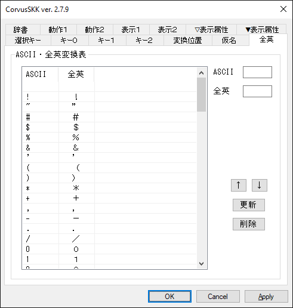

ASCII、全英文字の組み合せを指定します。最大で128行です。

## その他

### Lua拡張

辞書管理プロセス (imcrvmgr.exe) の各機能の拡張、プログラム実行変換もどき、数値変換をLuaスクリプトで実装しています。

現在使用しているLuaのバージョンは5.4.0です。

詳細はこちらを参照ください。https://www.lua.org/manual/5.4/manual.html

Lua内部の文字コードをUTF-8に決め打ちして、Unicode版のWindowsAPIとCランタイム関数を呼ぶようにパッチを当てています。

スクリプトファイルの文字コードはUTF-8のみに対応しています。

辞書管理プロセスのカレントディレクトリは %AppData%\CorvusSKK になっています。

コンソールプログラムのlua.exeが %SystemRoot%\System32\IME\IMCRVSKK と %SystemRoot%\SysWOW64\IME\IMCRVSKK にあるので、カスタマイズする際のデバッグ用に使ってください。

辞書管理プロセスの起動時にスクリプトファイル (init.lua) が下記の優先順位で読み込まれます。

1. %AppData%\CorvusSKK\init.lua
2. %SystemRoot%\IME\IMCRVSKK\init.lua (インストーラーによりインストール済み)

> **開発者向け**
>
> デバッグビルドでは、辞書管理プロセスのカレントディレクトリは %AppData%\CorvusSKK_DEBUG になっています。
>
> デバッグビルドでは、下記の優先順位でスクリプトファイルが読み込まれます。
>
> 1. %AppData%\CorvusSKK_DEBUG\init.lua
> 2. 実行ファイルと同じディレクトリのinit.lua (ビルドするとディレクトリ installer\config-lua から上書きコピーされます)

### プログラム実行変換もどき

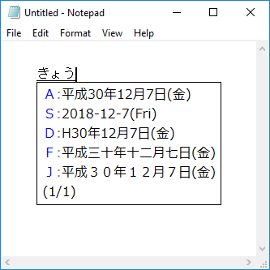

Emacs Lispのプログラム実行変換に対応していますが、あくまで「もどき」なのでご了承ください。

Emacs Lisp 辞書ファイル (SKK-JISYO.lisp) などが必要です。 https://github.com/skk-dev/dict/blob/master/SKK-JISYO.lisp

以下のシンボルに大体対応しています。

| 名称 | 説明 |
|---|---|
| nil |  |
| t |  |
| lambda |  |
| concat |  |
| substring |  |
| make-string |  |
| string-to-char |  |
| string-to-number |  |
| number-to-string |  |
| window-width | 80で固定 |
| window-height | 23で固定 |
| current-time |  |
| current-time-string |  |
| format-time-string |  |
| car | ほぼ skk-num-list 用 |
| cdr | ほぼ skk-num-list 用 |
| 1+ |  |
| 1- |  |
| + |  |
| - |  |
| skk-version |  |
| skk-server-version |  |
| skk-gadget-units-conversion |  |
| skk-ad-to-gengo |  |
| skk-gengo-to-ad |  |
| skk-current-date |  |
| skk-default-current-date |  |
| skk-relative-date |  |
| skk-ignore-dic-word | デフォルト無効 |
| skk-omikuji | 独自実装。おみくじを引くことができます。『(skk-omikuji)』 |
| skk-strftime | 独自実装。日時書式出力『(skk-strftime format [unit, diff])』 format : https://docs.microsoft.com/en-us/cpp/c-runtime-library/reference/strftime-wcsftime-strftime-l-wcsftime-l?view=vs-2019 unit : 単位 "year", "month", "day", "hour", "min", "sec" diff : 現在とunitとの差分 |
| fill-column | 70で固定 |
| comment-start | "/\*" |
| comment-end | "\*/" |
| skk-henkan-key | 変換する見出し語 |
| skk-num-list | 変換する見出し語に含まれる数値文字列のリスト |

skk-omikuji 辞書 https://github.com/nathancorvussolis/corvusskk/blob/master/installer/config-sample/skk-omikuji.txt

skk-strftime 辞書 https://github.com/nathancorvussolis/corvusskk/blob/master/installer/config-sample/skk-strftime.txt

### 数値変換

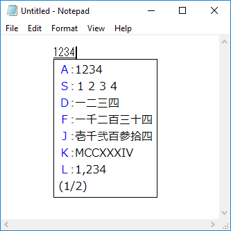

タイプ0〜3,5,8,9に対応しています。

タイプ3と5での数値は0〜10^72-1の整数に対応しています。

独自実装としてタイプ6(ローマ数字)が、1〜3999の整数に対応しています。

見出し語として # (ナンバーサイン)を含み、候補として # と数字を含むエントリが辞書に存在する必要があります。(例:「めいじ#ねん /明治#3年/」)

| 候補 | 説明 | 例 |
|---|---|---|
| #0 | タイプ０ 無変換            |「1234567890」→「1234567890」 |
| #1 | タイプ１ 全角              |「1234567890」→「１２３４５６７８９０」 |
| #2 | タイプ２ 漢数字 位取りあり |「1234567890」→「一二三四五六七八九〇」 |
| #3 | タイプ３ 漢数字 位取りなし |「1234567890」→「十二億三千四百五十六万七千八百九十」 |
| #5 | タイプ５ 大字              |「1234567890」→「拾弐億参千四百五拾六万七千八百九拾」 |
| #6 | タイプ６ ローマ数字(独自)  |「1234」→「MCCXXXIV」 |
| #8 | タイプ８ 桁区切り          |「1234567890」→「1,234,567,890」 |
| #9 | タイプ９ 将棋              |「12kin」→「１二金」 |

### Unicodeコードポイント変換

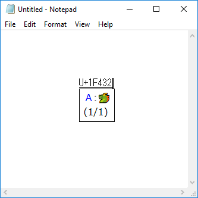

「U+XXXXXX」( コードポイント XXXXXX : 0000-FFFF または 10000-10FFFF ) または「uxxxxxx」( コードポイント xxxxxx : 0000-ffff または 10000-10ffff ) のフォーマットで変換してください。

* 例１）「▽U+30A2」→「▼ア」
* 例２）「▽u30a2」→「▼ア」

### JIS X 0213面区点番号、JIS X 0208区点番号変換

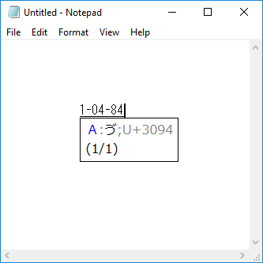

JIS X 0213では「X-YY-ZZ」( 面 X : 1-2、 区 YY : 01-94、点 ZZ: 01-94 )、JIS X 0208では「YY-ZZ」( 区 YY : 01-94、点 ZZ: 01-94 ) のフォーマットで変換してください。Unicodeコードポイントが注釈として付加されます。

* 例１）「▽1-05-02」→「▼ア;U+30A2」
* 例２）「▽05-02」→「▼ア;U+30A2」

### 文字コード表記変換

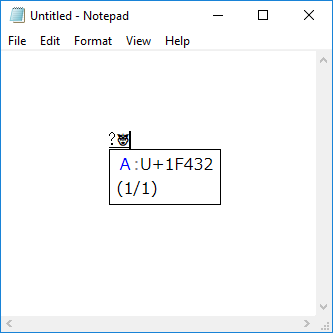

「?X」( X : 任意の1文字以上の文字列 ) のフォーマットで変換してください。

ASCII(hex), JIS X 0201(片仮名, 8bit, hex), JIS X 0213面区点番号のカンマ区切りの候補およびUnicodeコードポイントのカンマ区切りの候補に変換されます。

ASCII, JIS X 0201, JIS X 0213に変換できない文字が含まれていた場合、Unicodeコードポイントの候補のみとなります。

* 例１）「▽?ア」→「▼1-05-02」/「▼U+30A2」
* 例２）「▽?あアｱa」→「▼1-04-02,1-05-02,B1,61」/「▼U+3042,U+30A2,U+FF71,U+0061」
* 例３）「▽?🐧」→「▼U+1F427」

### 注釈の登録

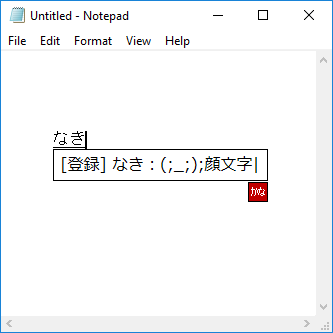

辞書登録のとき、登録する候補の入力と同時におこないます。

行頭以外の最後のセミコロン (いわゆる半角のセミコロン）以降が注釈となります。

注釈にセミコロンを含めることは出来ません。

* 例１）登録する見出し語「しょへい#ねん」、登録する候補「初平#3年」、登録する注釈「後漢」の場合
    * 「初平#3年;後漢」と入力する。

* 例２）登録する見出し語「なき」、登録する候補「(;_;)」、登録する注釈「顔文字」の場合
    * 「(;_;);顔文字」と入力する。

* 例３）登録する見出し語「せみころん」、登録する候補「;」、登録する注釈「セミコロン」の場合
    * 「;;セミコロン」と入力する。

### Windows 8, 8.1, 10 のタッチキーボード

タッチパネルを搭載したマシンでハードウェアキーボードに準拠したレイアウトを使用するには、以下の操作をおこなってください。

* Windows 8 の場合
    * 「PC設定」の画面 → 「全般」を選択 → 「タッチキーボード」の項目 → 「ハードウェアキーボードに準拠したレイアウトを使えるようにする」をオン

* Windows 8.1 の場合
    * 「PC設定」の画面 → 「PCとデバイス」の画面 → 「入力」を選択 → 「ハードウェアキーボードに準拠したレイアウトをタッチキーボードオプションとして追加する」をオン

* Windows 10 (Ver.1703 まで) の場合
    * 「デバイス」の画面 → 「入力」を選択 → 「ハードウェアキーボードに準拠したレイアウトをタッチキーボードオプションとして追加する」をオン

タッチパネルを搭載していないマシンでハードウェアキーボードに準拠したレイアウトを使用するには、レジストリに以下の値を設定してください。

Windows 10 (Ver.1703 まで) の場合

    [HKEY_CURRENT_USER\SOFTWARE\Microsoft\TabletTip\1.7]
    "EnableCompatibilityKeyboard"=dword:00000001

Windows 10 (Ver.1709 から) の場合

    [HKEY_CURRENT_USER\SOFTWARE\Microsoft\TabletTip\1.7]
    "DisableNewKeyboardExperience"=dword:00000001

### 開発環境

Visual Studio Community 2019 16.6.5

* Desktop development with C++
* MSVC v142 - VS 2019 C++ x64/x86 build tools (v14.26)
* MSVC v142 - VS 2019 C++ ARM build tools (v14.26)
* MSVC v142 - VS 2019 C++ ARM64 build tools (v14.26)
* C++ ATL for latest v142 build tools (x86 & x64)
* C++ ATL for latest v142 build tools (ARM)
* C++ ATL for latest v142 build tools (ARM64)

WiX Toolset v3.11.2

pandoc 2.10.1

### ビルド手順

ビルド

    > installer\_solution_build.cmd
    > installer\_build.cmd

ビルド ＆ 署名 ＆ 検証

    > installer\_solution_build.cmd
    > installer\_sign.cmd <SHA-1 hash> <URL>

        * <SHA-1 hash> : SHA-1 hash of certificate for SHA-256 file digest algorithm
        * <URL> : SHA-256 RFC-3161 timestamp server

    > installer\_verify.cmd

クリア

    > installer\_solution_clean.cmd
    > installer\_clean.cmd

---

Copyright (C) 2011-2020 SASAKI Nobuyuki

nathancorvussolis@gmail.com

https://nathancorvussolis.github.io/
